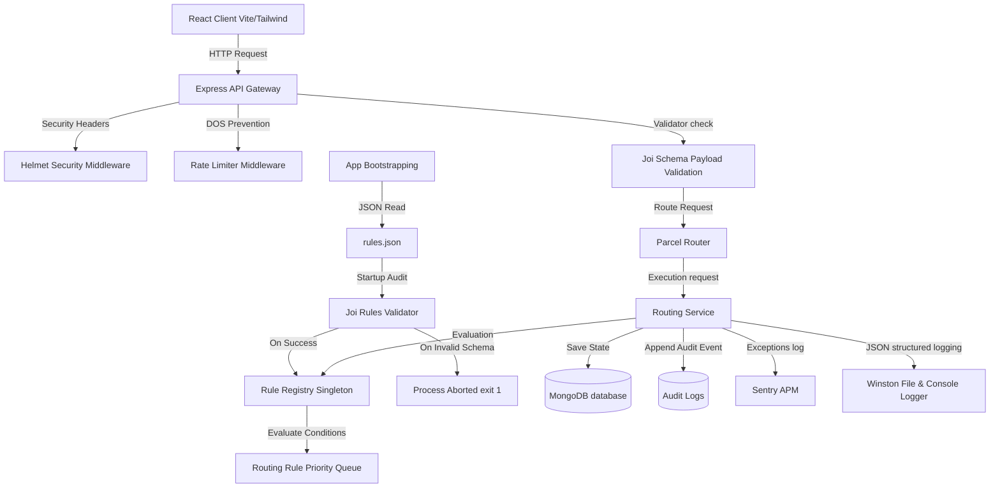

# Parcel Routing System

A production-ready, highly reliable, and secure **Parcel Routing System** built with the MERN stack (MongoDB, Express, React, Node.js). 

This system uses a dynamic, configurable **Rule Engine pattern** (supporting the Open-Closed Principle) rather than hardcoded if-else statements. This permits new routing rules—like country-specific channels—to be introduced simply by modifying external configuration files, without modifying any underlying engine code.

---

## 1. Project Overview & Architecture

The application evaluates parcels based on three parameters: **Weight (kg)**, **Value (€)**, and **Destination Country**.

### Default Routing Logic
1. **Weight &le; 1kg** &rarr; Routed to **Mail Department**
2. **Weight &le; 10kg** &rarr; Routed to **Regular Department**
3. **Weight &gt; 10kg** &rarr; Routed to **Heavy Department**
4. **Value &gt; €1,000** &rarr; Held for **Insurance Approval** (Status: `PENDING_INSURANCE_APPROVAL`), overriding weight classifications.

### Architecture Diagram



---

## 2. Folder Structure

```
routingsystem/
├── backend/
│   ├── src/
│   │   ├── config/
│   │   │   ├── db.js          # Mongoose DB connector
│   │   │   ├── logger.js      # Winston logging formatters
│   │   │   ├── rules.json     # Declarative external rule configs
│   │   │   └── sentry.js      # Sentry telemetry setup
│   │   ├── controllers/
│   │   │   └── parcelController.js # Stats, routing, and batch APIs
│   │   ├── middleware/
│   │   │   └── errorHandler.js# Centralized secure client error filter
│   │   ├── models/
│   │   │   ├── auditLog.js    # Audit Trail logs definition
│   │   │   └── parcel.js      # Parcel schema definitions
│   │   ├── routes/
│   │   │   └── parcelRoutes.js# Router mounting
│   │   ├── rules/
│   │   │   └── ruleEngine.js  # Base Rule and Registry class definitions
│   │   ├── services/
│   │   │   └── routingService.js # Orchestration layer connecting models/rules
│   │   ├── validators/
│   │   │   ├── parcelValidator.js # Payload validations
│   │   │   └── ruleValidator.js   # Configuration boot-time validator
│   │   └── app.js             # Express app setup (Helmet, Rate Limits, CORS)
│   │   └── index.js           # Server startup and boot configuration checks
│   ├── .env                   # Configuration dotenv parameters
│   └── package.json           # Backend dependencies and test scripts
└── frontend/
    ├── src/
    │   ├── components/
    │   │   └── Navbar.jsx     # Navigation and header
    │   ├── pages/
    │   │   ├── Dashboard.jsx  # Metrics visualizer & health visual logs
    │   │   ├── SingleRoute.jsx# Single shipment route utility
    │   │   └── BatchUpload.jsx# Drag & drop upload manifest table
    │   ├── services/
    │   │   └── api.js         # Axios endpoints map
    │   ├── App.jsx            # Core routing layout
    │   └── index.css          # Tailwind CSS v4 styling sheet
    ├── postcss.config.js      # Tailwind post-processor
    ├── tailwind.config.js     # Tailwind configurations
    └── package.json           # Frontend packages
```

---

## 3. Installation & Getting Started

### Prerequisites
* **Node.js**: `v18+` recommended
* **MongoDB**: A running instance locally on `mongodb://127.0.0.1:27017/routingsystem` or a MongoDB Atlas URI.

### Step 1: Install Backend dependencies
```bash
cd backend
npm install
```

### Step 2: Install Frontend dependencies
```bash
cd ../frontend
npm install
```

---

## 4. Environment Variables

Create a `.env` file in the `backend/` directory:
```env
PORT=5000
NODE_ENV=development
MONGODB_URI=mongodb://127.0.0.1:27017/routingsystem
CORS_ORIGIN=http://localhost:5173
SENTRY_DSN=
```

* `MONGODB_URI`: Points to your database.
* `CORS_ORIGIN`: Restricts cross-origin requests to only allow your React application.
* `SENTRY_DSN`: Provide a Sentry URL for production crash log integrations. Left empty, the system disables Sentry gracefully.

---

## 5. Running the Application Locally

To run both backend and frontend applications concurrently:

### Run Backend
```bash
cd backend
npm run dev
```
The server will run on `http://localhost:5000`.

### Run Frontend
```bash
cd frontend
npm run dev
```
The frontend dev server will launch on `http://localhost:5173`. Open your browser to explore the dashboard.

---

## 6. Running Tests

Automated boundary value, insurance validation, regression, and API testing are built using Jest and Supertest.

Run the test suite from the `backend` folder:
```bash
cd backend
npm run test
```

Tests run sequentially with open handle checks, mocking database connections for speed and stability.

---

## 7. Architectural Decisions & Trade-offs

### Configuration Safety Checks at Startup
* **Decision**: Validate `rules.json` at boot-time with Joi. If invalid, log and call `process.exit(1)`.
* **Rationale**: Moving business rules to configuration files creates operational risk. If an operator types `weight_limit` instead of `weight` or enters a string instead of a number, it could break core routing logic. Validating the configuration on start-up protects the production environment.
* **Trade-off**: Requires a brief container restart when updating rules in a CI/CD pipeline, rather than performing live database updates. However, it guarantees rules are static, checked, and run in memory for high performance.

---

## 8. Monitoring Strategy

1. **Winston Structured Logger**: Writes standard JSON logs containing context objects (`weight`, `value`, `matchedRule`, `parcelId`) to `backend/logs/combined.log` and error stack traces to `backend/logs/error.log`.
2. **Centralized Exception Catcher**: An Express middleware intercepts all runtime uncaught exceptions. In production mode, it sanitizes responses, returns a secure payload without leaks, and records the event to Winston/Sentry.
3. **Sentry Integration**: Integrated at the application level to automatically capture uncaught syntax or database connection errors.

---

## 9. Security Measures

* **Helmet**: Configures HTTP headers to restrict MIME types, protect against clickjacking, and enforce HTTPS.
* **Express Rate Limiter**: Limits client IPs to 100 requests per 15 minutes to block DDoS/brute-force attacks.
* **Sanitized Responses**: Custom error handler ensures database exceptions or configuration file syntax errors never leak in responses to endpoints.
* **Payload Limit**: JSON body parsing restricts payload inputs to `1mb` to prevent memory exhaustion attempts.

---

## 10. AI Usage Documentation

### AI Tool #1: Used for Rule Engine design
* **Example Prompt**:
  > "Design a lightweight, extendable Rule Engine in Node.js that complies with the Open-Closed Principle. The rules must be read from a JSON file, representing conditions on weight, value, and country parameters. Avoid hardcoded nested if-else structures."
* **Result Summary**: The tool generated a prototype showing a Rule class evaluating attributes using basic operand checks.
* **Manual Modifications**: Added case-insensitive matching for country configurations, priority sorting descending to guarantee execution safety, and customized Winston logging of matched rule metadata.
* **Limitations**: The AI code lacked type constraints, allowing undefined fields to throw uncaught exceptions during comparisons. Joi configuration checking was implemented manually to mitigate this.

### AI Tool #2: Used for test generation
* **Example Prompt**:
  > "Write a Jest integration test file with Supertest targeting API routes. Mock Mongoose models so that we do not require a live MongoDB server during Jest runtime."
* **Result Summary**: Created test routes executing mock REST operations.
* **Manual Modifications**: Enhanced tests to check boundary values of weight classifications (e.g. `10.0kg` vs `10.1kg`), added test cases for configuration validation safety, and wrote regression checks simulating adding new rules.
* **Limitations**: The mock model structures generated by the AI did not support standard Mongoose constructor syntax (`new Parcel(data)`), which threw errors when calling mock `.save()`. Resolved by implementing full constructor prototype mocks.

---

## 11. Safe Feature Development Lifecycle (CI/CD Regression Prevention)

To safely implement the example request (**Germany** &rarr; **EU Express Department**) without risking regression of existing rules:

### Step 1: Create a feature branch
```bash
git checkout -b feature/eu-express-routing
```

### Step 2: Declare the new routing rule in configuration
Open `backend/src/config/rules.json` and insert the new rule with a priority that sits beneath insurance checks but above default weight routing (priority `95` is ideal):
```json
  {
    "id": "germany-express-rule",
    "name": "EU Express Germany Rule",
    "conditions": [
      { "field": "destinationCountry", "operator": "equal", "value": "Germany" }
    ],
    "action": {
      "department": "EU Express Department",
      "status": "ROUTED"
    },
    "priority": 95
  }
```

### Step 3: Add automated tests
Add cases verifying:
* Germany parcel with low weight routes to **EU Express** rather than Mail.
* Germany parcel with value > 1000 still routes to **Insurance** first (Priority 100 > 95).
* France parcel with low weight continues routing to **Mail** (Priority 90) without regression.

### Step 4: Run tests & verify compilation
```bash
npm run test
npm run build
```
Verify tests pass.

### Step 5: Pull Request & Merge
Push code to repository, review code structures in PR, and merge:
```bash
git add .
git commit -m "feat: implement country-specific express routing rule for Germany"
git push origin feature/eu-express-routing
# Merge PR in GitHub/GitLab on successful CI pipeline run
```
This guarantees zero code change regressions.
